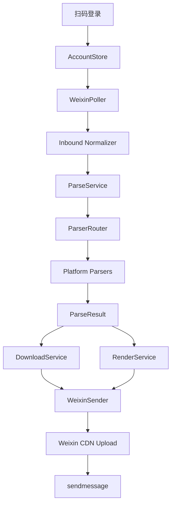

# claw-wechat-parser

一个全新的独立微信 Claw/iLink 链接解析 Bot。

目标是迁移并实现 [`astrbot_plugin_parser`](https://github.com/Zhalslar/astrbot_plugin_parser) 的核心能力，同时不依赖 AstrBot：

```text
微信扫码登录 -> 长轮询收消息 -> 链接匹配 -> 平台解析 -> 下载/渲染 -> 微信 CDN 上传 -> 回复用户
```

当前仓库是第一阶段 MVP 骨架：

- ✅ 微信 Claw/iLink 扫码登录流程
- ✅ 账号 token 本地持久化
- ✅ `getupdates` 长轮询框架
- ✅ `sendmessage` 文本/媒体发送框架
- ✅ 微信 CDN AES-128-ECB 上传流程
- ✅ 解析器注册机制 `BaseParser + @handle`
- ✅ 通用网页 OpenGraph 解析器
- ✅ Bilibili 完整解析迁移：视频/音频/动态/直播/收藏夹/专栏/图文
- ✅ 抖音解析迁移：短链/视频/图文/幻灯片
- ✅ 小红书解析迁移：短链/图文/视频，支持 cookie 环境变量
- ✅ Instagram 解析迁移：Post/Reel/TV/Share，yt-dlp + gallery-dl 兜底
- ✅ YouTube 解析迁移：视频/Shorts/短链，支持 `ym` 前缀音频模式
- ✅ Twitter/X 解析迁移：x.com/twitter.com status，基于 xdown.app 提取媒体
- ✅ 本地解析测试 CLI
- ✅ 防抖、缓存、卡片渲染基础设施

> 注意：完整平台解析器会在后续阶段从 `astrbot_plugin_parser` 迁移；当前 B 站/通用链接用于验证微信端到端链路。

## Docker Compose 快速部署

推荐 VPS 使用 Docker Compose：

```bash
cd /opt
git clone https://github.com/wuuduf/claw-wechat-parser.git
cd /opt/claw-wechat-parser
cp .env.example .env
docker compose build
docker compose run --rm claw-parser login-wechat
docker compose up -d
```

查看日志：

```bash
docker compose logs -f
```

详细说明见 [`docs/DOCKER.md`](docs/DOCKER.md)。

## 安装

```bash
cd /Users/jelly/github/claw-wechat-parser
python3 -m venv .venv
source .venv/bin/activate
pip install -e .
```

## 使用

> 视频音频合并依赖系统 `ffmpeg`。macOS 可用 `brew install ffmpeg`，Debian 可用 `apt install ffmpeg`。


### 1. 微信扫码登录

```bash
claw-parser login-wechat
```

凭据默认保存到：

```text
~/.claw-wechat-parser/accounts/
```

也可以指定状态目录：

```bash
claw-parser --help
claw-parser login-wechat --state-dir ./.state
```

### 2. 启动 Bot

```bash
claw-parser serve
```

指定账号：

```bash
claw-parser serve --account <account_id>
```

### 3. 本地测试解析器

```bash
claw-parser parse '看看这个 https://www.bilibili.com/video/BV1xx411c7mD'
claw-parser parse 'https://example.com'
```

### 4. 查看账号

```bash
claw-parser accounts list
```

## 目录结构

```text
src/claw_wechat_parser/
  cli.py                    # Typer CLI
  config.py                 # 环境变量/路径配置
  domain/                   # 与平台无关的数据模型
  weixin/                   # 微信 Claw/iLink 接入
    api.py                  # getupdates/sendmessage/getuploadurl
    auth.py                 # 扫码登录
    poller.py               # 长轮询主循环
    sender.py               # 文本/媒体发送
    cdn.py                  # AES-128-ECB CDN 上传
    inbound.py              # 微信消息归一化
  parser/                   # 链接解析器系统
    base.py                 # BaseParser/@handle
    router.py               # 关键词 + 正则路由
    platforms/              # 平台解析器
  services/                 # 下载、渲染、防抖、解析编排
  storage/                  # 账号、sync buf、context token 存储
```

## 架构



## 迁移计划

### Phase 1：微信链路 MVP

- [x] 扫码登录
- [x] 长轮询
- [x] 文本发送
- [x] 图片/视频/文件上传发送框架
- [x] 通用解析器

### Phase 2：迁移核心解析器

- [x] Bilibili 完整解析：视频/音频/动态/直播/收藏夹/专栏/图文
- [x] 抖音：短链/视频/图文/幻灯片
- [x] 小红书：短链/图文/视频
- [ ] B 站扫码登录 CLI
- [ ] 微博
- [ ] 快手
- [ ] 小黑盒
- [ ] 知乎

### Phase 3：补齐全平台

- [x] YouTube
- [ ] TikTok
- [x] Instagram
- [x] Twitter/X
- [ ] 网易云音乐
- [ ] NGA
- [ ] AcFun

### Phase 4：生产化

- [ ] SQLite 状态库
- [ ] 多账号并发
- [x] Docker Compose 部署
- [ ] systemd unit
- [ ] Web 管理面板
- [ ] 限速/配额/缓存 LRU

## 关键环境变量

| 变量 | 默认值 | 说明 |
|---|---|---|
| `CLAW_PARSER_STATE_DIR` | `~/.claw-wechat-parser` | 状态目录 |
| `CLAW_PARSER_API_BASE_URL` | `https://ilinkai.weixin.qq.com` | iLink API 地址 |
| `CLAW_PARSER_CDN_BASE_URL` | `https://novac2c.cdn.weixin.qq.com/c2c` | 微信 CDN 地址 |
| `CLAW_PARSER_ILINK_BOT_TYPE` | `3` | 二维码 bot_type |
| `CLAW_PARSER_MAX_MEDIA_SIZE_MB` | `80` | 单媒体大小限制 |
| `CLAW_PARSER_DEBOUNCE_SECONDS` | `300` | 防抖窗口 |
| `CLAW_PARSER_BILIBILI_COOKIE` | 空 | Bilibili Cookie，用于高画质/AI 总结等登录能力 |
| `CLAW_PARSER_BILIBILI_VIDEO_QUALITY` | `_720P` | Bilibili 下载清晰度 |
| `CLAW_PARSER_BILIBILI_VIDEO_CODECS` | `AVC` | Bilibili 视频编码偏好 |
| `CLAW_PARSER_DOUYIN_COOKIE` | 空 | 抖音 Cookie，可提升解析稳定性 |
| `CLAW_PARSER_XHS_COOKIE` | 空 | 小红书 Cookie；遇到风控/不可浏览时通常需要配置 |
| `CLAW_PARSER_INSTAGRAM_COOKIE` | 空 | Instagram Cookie；私密/风控内容通常需要配置 |
| `CLAW_PARSER_YOUTUBE_COOKIE` | 空 | YouTube Cookie；受限/高风控视频通常需要配置 |
| `CLAW_PARSER_TWITTER_COOKIE` | 空 | xdown.app Cookie，可提升 Twitter/X 解析稳定性 |
| `CLAW_PARSER_MAX_MEDIA_DURATION_S` | `900` | 超过该时长的视频默认只发封面/元信息 |

## 安全说明

- 本项目使用扫码授权后返回的 `bot_token`，本地凭据文件会尝试设置为 `0600`。
- 不使用 PC 微信 Hook、iPad 协议或逆向客户端注入。
- 建议先在小号和私聊场景验证，确认接口稳定后再长期运行。
